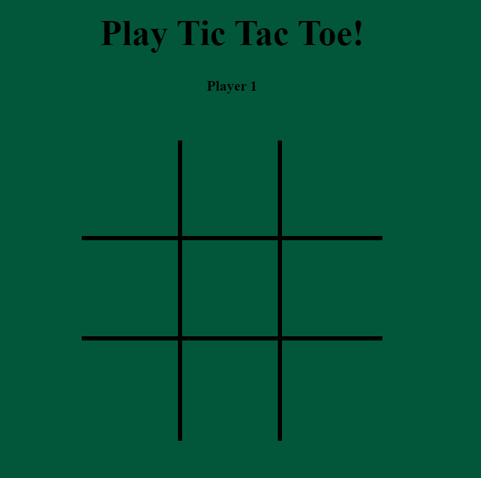

# Tic Tac Toe

## Description

Tic Tac Toe is a classic two-player game where players take turns marking spaces in a 3x3 grid, aiming to get three of their symbols (X or O) in a row, column, or diagonal. It's a simple yet engaging game that tests players' strategic thinking and anticipation.

## Features

**Classic Gameplay**: Enjoy the timeless gameplay of Tic Tac Toe in a digital format.

## How to Play

1. **Objective**: The goal of Tic Tac Toe is to get three of your symbols (X or O) in a row, column, or diagonal on the game grid.
2. **Gameplay**: Players take turns placing their symbols in empty spaces on the 3x3 grid until one player achieves the objective.
3. **Strategy**: Plan your moves strategically to block your opponent's attempts while aiming to create your winning combinations.
4. **Winning**: The player who first gets three of their symbols in a row, column, or diagonal wins the game!

## License

This game is distributed under the [MIT License](https://opensource.org/licenses/MIT). See the LICENSE file for more details.
